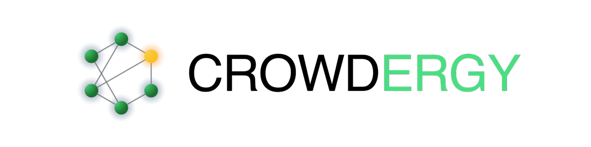

  <picture>
    <source media="(prefers-color-scheme: dark)" srcset="images/logo-dark.png">
    
  </picture>

# Crowdergy Connector

Home Assistant custom integration that bridges your local energy entities
(solar inverter, battery, wallbox, grid meter, heat pump …) into the
Crowdergy platform.

State changes of the configured entities are pushed to the Crowdergy
backend in near-real-time. From there they are visualised in the
Crowdergy iOS app and aggregated for community flexibility.

## Installation

### HACS (recommended)

Or manually:

1. HACS → Integrations → ⋮ → **Custom repositories**
2. URL: `https://github.com/colinwilke/crowdergy-connector`
3. Category: **Integration**
4. Install **Crowdergy Connector**
5. Restart Home Assistant

### Manual

Copy `custom_components/theothergas/` into your HA `config/custom_components/`
directory and restart Home Assistant.

## Configuration

After install:

1. Settings → Devices & Services → **Add Integration** → "Crowdergy Connector"
2. Step 1 — Login with your Crowdergy account
3. Step 2 — Location (Stadtteil, Stadt, Region — for community aggregation)
4. Step 3 — Add a device: name, type, and the HA entities for power /
   state of charge / active status
5. Step 4 — Add more devices or finish

Devices can be added or removed later via the integration's
**Configure** menu.

## Supported device types

`solar`, `battery`, `wallbox`, `grid`, `heatpump`, `generic`

## How it works

- The coordinator subscribes to state-change events of the configured
  entities and pushes telemetry to the backend on every change.
- A 60 s heartbeat ensures presence even when values are stable.
- Power sensors reporting in **W** are auto-converted to **kW** based on
  the entity's `unit_of_measurement`.

## License

MIT — see [LICENSE](LICENSE).
